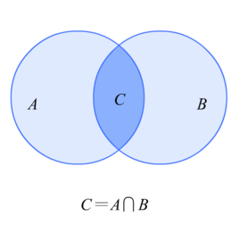
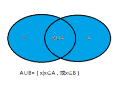
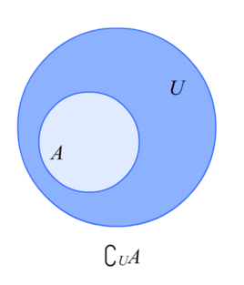

# 集合 
## 集合的基本概念
  * 集合元素的性质:
    - 确定性, eg：中国最长的河流，就是不确定性的体现
    - 互异性, eg：{1，m}，则m≠1
    - 无序性; eg：{1,2,3,4}={2,3,4,1}
  * 元素与集合的关系
    - 属于，记为∈； a∈A
    - 不属于，记为∉；b∉B
  * 常见数集的符号
    |集合|自然数集|正整数集|整数集|有理数集|质数（素数）集|实数集|
    |:--:|:--:|:--:|:--:|:--:|:--:|:--:|
    |符号|N|N+或N*|Z|Q|P|R|
    |示例|0,1,2,3……|1,2,3……|……-1,0,1,2……|有理数集是实数集的子集|1,3,5,7,11,13|包含所有有理数和无理数的集合|
  * 集合的表示方法：
    - 列举法
    - 描述法
    - 图示法
  * 集合间的基本关系
    |表示/方法|文字语言|符号语言|
    |:--:|:--:|:--:|
    |相等|集合A与集合B中的所有元素相同|A=B或B=A|
    |子集|A中的任意一个元素均为B中的元素|A⊆B或B⊇A|
    |真子集|A中的任意一个元素均为B中的元素，且B中至少有一个元素不是A中的元素|A⫋B|
    |空集|空集是任何集合的子集，是任何非空集合的真子集|∅⊆A，∅⫋B|
  * 集合的基本运算
    - 交集
      * 
      * 符号：`∩`
    - 并集
      * 
      * 符号：`∪`
    - 补集
      * 
      * 符号：`∁UA`
## 必会结论
  1. A∪B=A <=> B⊆A, A∩B=A <=> A⊆B
  2. A∩A=A，A∩∅=∅
  3. A∪A=A，A∪∅=A
  4. A∩（A的补集）=∅，A∪(A的补集)=全集(U)，A取两次补集，最后就是A本身
  5. A⊆B<=>A∩B=A<=>A∪B=B<=>B的补集⊆A的补集<=>A∩B的补集=∅
  6. 若集合A中含有N个元素，则它的子集个数为2的n次方，真子集个数为2的n次方-1（去掉子集），非空真子集为2的N次方-2（再去掉空集）